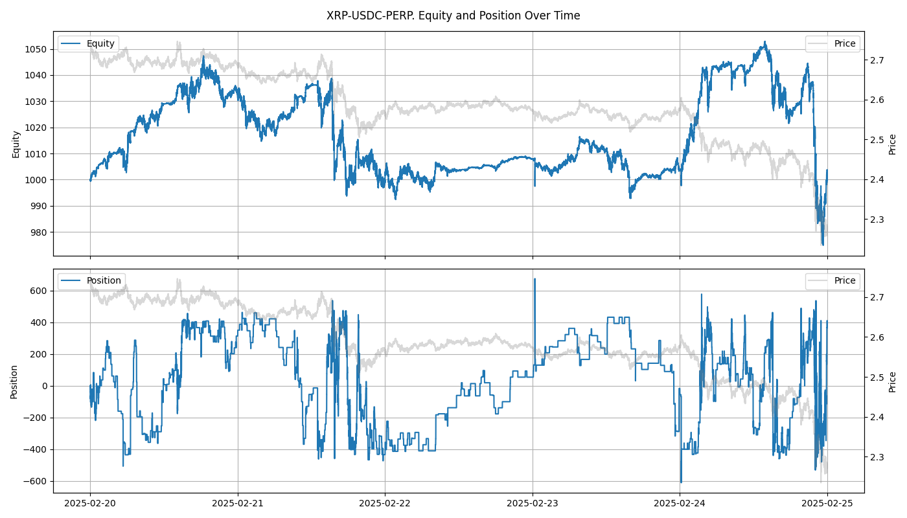

# Example Strategy: Grid Trading

This example demonstrates how to implement, configure, and run a grid trading strategy using **CryptoQuantEngine**.

---

## What is Grid Trading?

Grid trading is a market making strategy that places buy and sell limit orders at multiple price levels around the mid price.  
It dynamically manages the grid, cancels and resubmits orders, and respects position and notional limits.

---

## Configuration

Grid trading parameters are set in `config/grid_trading_config.txt`:
```plaintext
tick_size=0.01
lot_size=0.1
grid_num=20
grid_interval=10
half_spread=10
position_limit=400.0
notional_order_qty=100.0
```

**Parameter descriptions:**
- `grid_num`: Number of grid levels on each side (bid/ask)
- `grid_interval`: Tick interval between grid levels
- `half_spread`: Half the spread in ticks for grid centering
- `position_limit`: Maximum allowed position size
- `notional_order_qty`: Notional value per grid order (USD)

---

## Instantiating the Strategy

In `backtest_main.cpp`, instantiate the grid trading strategy:
```cpp
#include "core/strategy/grid_trading_/grid_trading.h"
const auto grid_config = config_reader.get_grid_trading_config("config/grid_trading_config.txt"); // load config
core::strategy::GridTradingStrategy grid_strategy(grid_config, logger);
```
---

## Running the Strategy in a Backtest Loop

The grid trading strategy is called on each simulation step:
```cpp
while (engine.elapse(backtest_config.elapse_us) && iter-- > 0) { 
    engine.clear_inactive_orders(); 
    grid_trading.on_elapse(engine);
    recorder.record(engine, asset_id);
}
```
### Example Output: Equity and Position Over Time

After running the grid trading strategy, you can visualize the results:
```cpp
recorder.plot(asset_config.name_);
```


The plot shows the evolution of portfolio equity and position for the selected asset throughout the backtest.

### Example Output: Statistics Summary
After running the backtest, you can print a summary of statistics:
```cpp
recorder.print_performance_metrics();
engine.print_trading_stats(asset_id);
```
```plaintext
=== Performance Metrics ===
Sharpe Ratio   : 0.4941
Sortino Ratio  : 0.4205
Max Drawdown   : 7.42%
===========================
=== Trading Statistics for : XRP-USDC-PERP ===
Number of Trades   : 6183
Trading Volume     : 117959.30
Trading Value      : 294671.14 USDC
==========================================
```
## How GridTrading Works

- On each step, the strategy:
- Queries the order book and current position.
- Cancels orders not in the new grid.
- Submits new buy/sell limit orders at calculated grid prices.
- Ensures position limits are respected. 
    -  If the position exceeds limits, it cancels orders on that side to bring position back within bounds.

---

## Customizing and Extending

To create your own strategy:
- Inherit from the `Strategy` base class.
- Implement `initialize()` and `on_elapse()`.
- Use the `BacktestEngine` to access market data and submit/cancel orders.

See [Strategies Guide](strategies.md) for more details.

---

## Further Reading

- [Configuration Guide](configuration.md)
- [Strategies Guide](strategies.md)
- [Usage Guide](usage.md)

---
